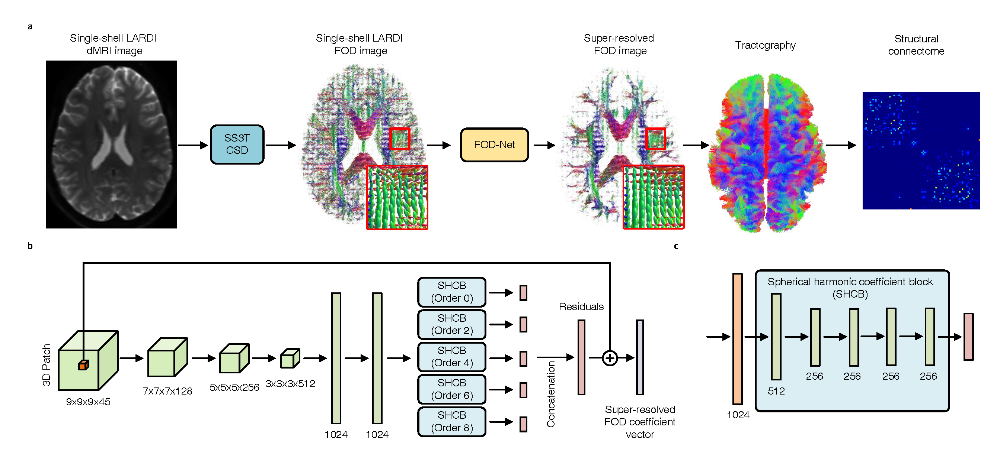
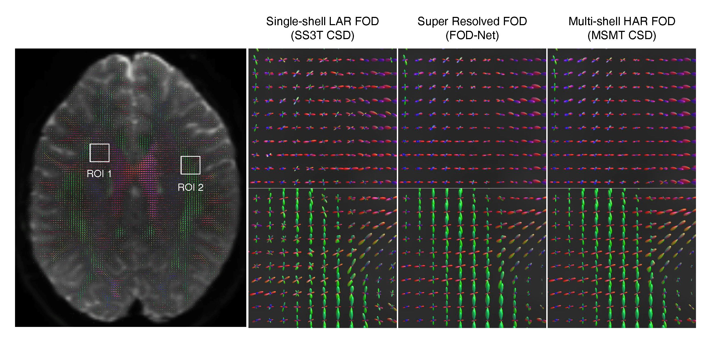
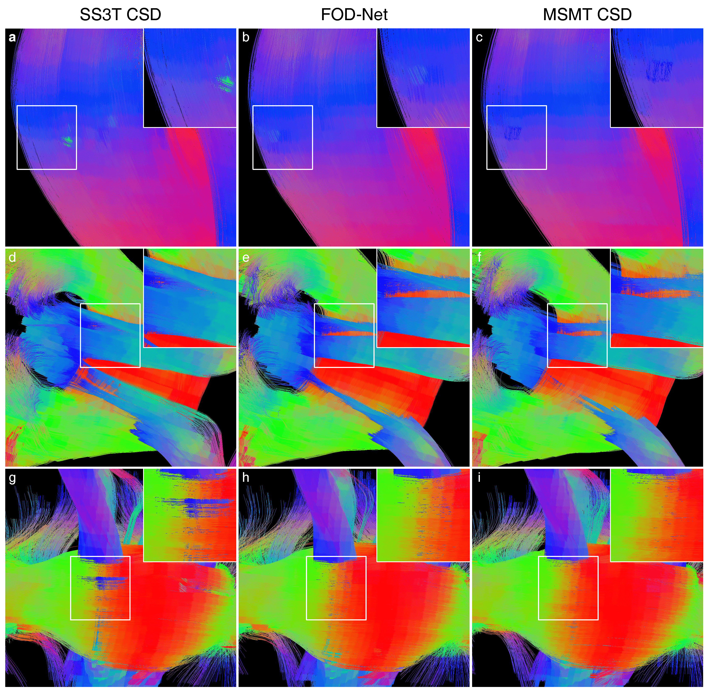
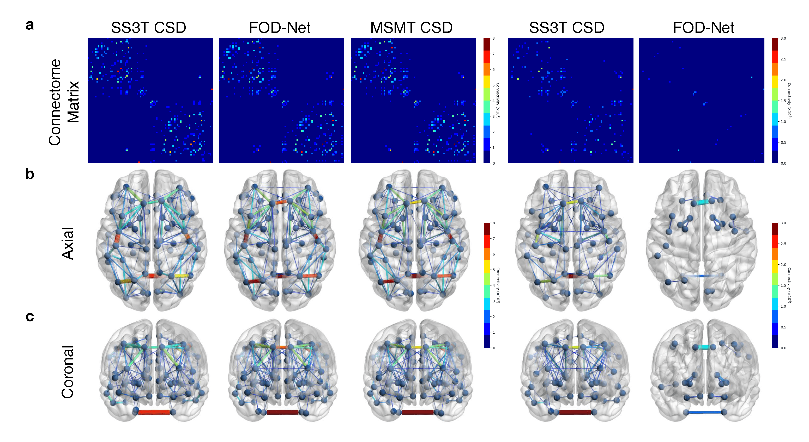

[](https://creativecommons.org/licenses/by-nc-sa/4.0/)
***
# FOD-Net: A Deep Learning Method for Fiber Orientation Distribution Angular Super Resolution
## Introduction
The fiber orientation distribution, which is able to perform high-quality tractography permitting the study of brain connectivity, is optimally estimated from high angular resolution diffusion imaging (HARDI) data. However, acquiring HARDI data is very time consuming, thus limiting broad application in both clinical and clinical research environments. In this regard, single-shell low angular resolution diffusion imaging (LARDI) data are more commonly used in clinical settings, and often combined with
lower b-values (e.g. $b = 1000 s/mm^2$). However, LARDI acquisitions cannot reliably resolve complex white matter fiber bundles configurations due to insufficient angular resolution, producing both spurious and missing connections. This can degrade the connectome reconstruction, potentially impacting the validity of conclusions drawn from
such data. To address this issue, we present fiber orientation distribution (FOD) network (FOD-Net), a deep-learning-based FOD angular super resolution method that directly enhances FOD data from single-shell LARDI computed from typical clinical-quality data, to obtain the super-resolved FOD data equivalent to those derived from high-quality multi-shell HARDI acquisitions, thereby enabling reliable tractography and structural connectome reconstruction using widely available clinical protocols.

***The code was written and is under maintenance by [Rui Zeng](https://sites.google.com/site/ruizenghomepage/).***

This updated PyTorch implementation produces results comparable to or better than our original pytorch software. If you would like to reproduce the same results as in the papers, check out the initial version of the paper in the BioRxiv.

If you use this code for your research, please cite:

FOD-Net: A Deep Learning Method for Fiber Orientation Distribution Angular Super Resolution.<br>
[Rui Zeng](https://sites.google.com/site/ruizenghomepage/), Jinglei Lv, He Wang, Luping Zhou, Michael Barnett, Fernando Calamante\*, Chenyu Wang\*. In [BioRxiv](https://www.biorxiv.org/content/10.1101/2021.01.17.427042). (* equal contributions) [[Bibtex]](fodnet.txt)

## Abstract and Highlights
Our highlights can be concluded as follows:
- A deep-learning-based framework for FOD angular super-resolution in dMRI data is proposed (Please see the architecture in Figure 1).
- FOD-Net improves the FOD angular resolution of FOD images acquired with single-shell LARDI dMRI data to approximate the quality of multi-shell high-angular-resolution dMRI FODs (Please see the demonstration in Figure 2).
- The benefits of the super-resolved FODs in tractography and connectomics are demonstrated compared to single-shell LARDI dMRI data (please see Figure 3 and Figure 4 for tractography and brain connectivity improvements).

<br>
Figure 1 **FOD-Net achitecture**
<br/>
<br/>
<br>
Figure 2 **FOD super resolution demonstration**
<br/>
<br/>
<br>
Figure 3 **Tractography improvement**
<br/>
<br/>
<br>
Figure 4 **Connectomic improvement**

## Prerequisites
- Linux or macOS
- Python 3
- CPU or NVIDIA GPU + CUDA CuDNN
- [MRTrix](https://www.mrtrix.org/)
- [3Tissue CSD](https://3tissue.github.io/doc/ss3t-csd.html)

## Getting Started
### Installation

- Clone this repo:
```bash
git clone https://github.com/ruizengalways/FOD-Net.git
cd FOD-Net
```
- Install [PyTorch](http://pytorch.org) and 1.4.0 and other dependencies (e.g., [nibabel](https://nipy.org/nibabel/) and [dipy](https://dipy.org/)).
- Please use ```pip install``` to install the missing python packages if ```ImportError: No module named``` error message occurs

### Human Connectome Project dataset preparation
The description about this dataset can be found in this [link](https://www.humanconnectome.org/study/hcp-young-adult/data-releases)

To train FOD-Net, we first need to generate single-shell LARDI dMRI data from multi-shell dMRI data first. As the size of HCP dataset is too large, I have prepared the toy dataset, which only contains one subject, for you to play around. Please download this compressed dataset ([link](https://unisyd-my.sharepoint.com/:u:/g/personal/rui_zeng_sydney_edu_au/EXHhudtVYzRPspcGJwftTWIBcZYUJly-0SpqJIOW9vtxyg?e=YXimo9)) and uncompress it into ```/dataset```.

The directory tree of ```/dataset``` should look like the following after uncompressing the file:

```bash
.
└── 111009
    ├── brain_mask.nii.gz
    ├── fsl_5ttgen.nii.gz
    ├── HARDI_data
    │   ├── bvals
    │   ├── bvecs
    │   └── data.nii.gz
    └── LARDI_data
        ├── data_b1000_g32.bvals
        ├── data_b1000_g32_bvecs
        └── data_b1000_g32.nii.gz

```

HARDI_data refers to the original dMRI data copied from the Human Connectome Project dataset. ```bvecs``` and ```bvals``` are its corresponding diffusion gradient table and b value respectively (288 directions in total). LARDI_data is the angular downsampling version of HARDI_data, in which diffusion gradients and b values are downsampled to a number equaling to 32. The method for downsampling diffusion MRI is introduced in the original FOD-Net paper. ```brain_mask.nii.gz``` is the brain mask of the subject. ```fsl_5ttgen.nii.gz``` is the five-tissue mask generated using ```5ttgen``` [(link)](https://mrtrix.readthedocs.io/en/dev/reference/commands/5ttgen.html) in ```MRTrix```.

1. Perform ```./util/HCP_dataset_preparation.py``` to generate normalised multi-shell multi-tissue constrained spherical deconvolution (MSMT CSD) FOD images for HARDI data as well obtaining normalised single-shell three-tissue constrained spherical deconvolution (SS3T CSD) FOD images for LARDI data. All FOD images are normalised using ```mtnormalise``` [(link)](https://mrtrix.readthedocs.io/en/latest/reference/commands/mtnormalise.html) to put them into the same scalar level. Once the process is done, you should get the directory tree as the following:

```bash
.
└── 111009
    ├── brain_mask.nii.gz
    ├── fsl_5ttgen.nii.gz
    ├── HARDI_data
    │   ├── bvals
    │   ├── bvecs
    │   └── data.nii.gz
    ├── LARDI_data
    │   ├── data_b1000_g32.bvals
    │   ├── data_b1000_g32_bvecs
    │   └── data_b1000_g32.nii.gz
    ├── msmt_csd
    │   ├── CSF_FODs.nii.gz
    │   ├── CSF_FODs_normalised.nii.gz
    │   ├── GM_FODs.nii.gz
    │   ├── GM_FODs_normalised.nii.gz
    │   ├── RF_CSF.txt
    │   ├── RF_GM.txt
    │   ├── RF_WM.txt
    │   ├── WM_FODs.nii.gz
    │   └── WM_FODs_normalised.nii.gz
    └── ss3t_csd
        ├── CSF_FODs.nii.gz
        ├── CSF_FODs_normalised.nii.gz
        ├── GM_FODs.nii.gz
        ├── GM_FODs_normalised.nii.gz
        ├── RF_CSF.txt
        ├── RF_GM.txt
        ├── RF_WM.txt
        ├── WM_FODs.nii.gz
        └── WM_FODs_normalised.nii.gz
```

The ```./${subject_id}/ss3t_csd/WM_FODs_normalised.nii.gz``` and ```./${subject_id}/msmt_csd/WM_FODs_normalised.nii.gz``` will be used as the LARDI (low resolution input) and HARDI data (ground truth target) pair for the training process.

### FODNet train

To train a model, please run

```bash
python train.py --dataroot ./dataset/ --dataset_mode hcp --cfg ./config/fodnet_updated_config.yml
```

You can adjust the FOD-Net parameters either using arguments or cfg files located at ```./config/*.yml```

## FODNet inference

As this is a toy dataset, ```./${subject_id}/ss3t_csd/WM_FODs_normalised.nii.gz``` is also served as a input for testing the performance of our model. The output path is set to ```./dataset/${subject_id}/fodnet/SR_WM_FODs_normalised.nii.gz``` for the sake of convenience.

If you do not have time to train the model, you could download the pretrained model from this [link](https://unisyd-my.sharepoint.com/:u:/g/personal/rui_zeng_sydney_edu_au/EWXv0zjEnNFKsE5qUhkPNywBCPiS-s0rArtlpUcgsDapbQ?e=76cITr), and then put it into ```./```

Please run the following
```bash
python test.py --fod_path ./dataset/${subject_id}/ss3t_csd/WM_FODs_normalised.nii.gz --weights_path ./fodnet.pth --output_path ./dataset/${subject_id}/fodnet/SR_WM_FODs_normalised.nii.gz --brain_mask_path ./dataset/${subject_id}/brain_mask.nii.gz --gpu_ids 0
```

For each subject, it takes around 3 hours to finish inference. Do some sports and then come back to enjoy the super-resolved FOD image!
## Tractography and connectomic

We use ```tckgen``` [link](https://mrtrix.readthedocs.io/en/latest/reference/commands/tckgen.html) and ```tck2connectome``` [link](https://mrtrix.readthedocs.io/en/latest/reference/commands/tck2connectome.html). Please read the documents to learn.

## Citation
If you use this code for your research or find our work is inspiring, please cite our papers.
```
@article{zeng2021fod,
title={FOD-Net: A Deep Learning Method for Fiber Orientation Distribution Angular Super Resolution},
author={Zeng, Rui and Lv, Jinglei and Wang, He and Zhou, Luping and Barnett, Michael and Calamante, Fernando and Wang, Chenyu},
journal={bioRxiv},
year={2021},
publisher={Cold Spring Harbor Laboratory}
}
```

[](https://creativecommons.org/licenses/by-nc-sa/4.0/)
